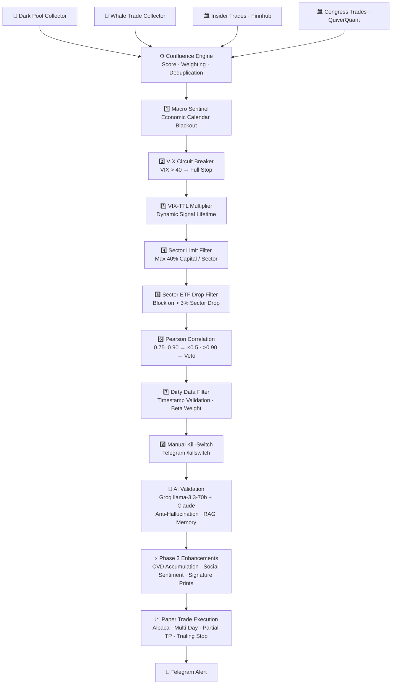

<div align="center">

# 🧠 Smart Money Tracker v2

[](https://python.org)
[](LICENSE)
[](https://github.com/abbasrobaei/Smart-Moneytracker)
[](https://alpaca.markets)
[](https://docker.com)

**An autonomous, AI-powered trading bot that detects institutional money movements in real time and executes trades automatically via Alpaca Paper Trading.**

Smart Money Tracker monitors Dark Pool prints, Whale trades, Insider transactions and Congress trades simultaneously, correlates signals through a multi-layer Confluence Engine, and validates every trade decision with Groq AI (llama-3.3-70b) and Anthropic Claude — before any order is placed.

</div>

---

## 📑 Table of Contents

1. [Overview](#-overview)
2. [Architecture](#-architecture--signal-pipeline)
3. [Features](#-features)
4. [Signal Sources](#-signal-sources)
5. [Risk Management — 8 Layers](#-risk-management--8-layers)
6. [AI Integration](#-ai-integration)
7. [Tech Stack](#-tech-stack)
8. [Project Structure](#-project-structure)
9. [Quick Start](#-quick-start)
10. [Environment Variables](#-environment-variables)
11. [Roadmap](#-roadmap)
12. [Contributing](#-contributing)
13. [License](#-license)

---

## 🔭 Overview

Smart Money Tracker v2 is a fully asynchronous, production-grade trading system built around **institutional signal confluence**. Unlike single-indicator bots, it requires **4 independent institutional signals** to agree before a trade is validated by two separate LLMs — and even then, 8 sequential risk filters can veto or size-down the position.

| Metric | Target |
|---|---|
| Paper Trading Start | 03 March 2026 |
| Watchlist | 59 US Large / Mid Cap tickers |
| Win-Rate Target | > 55% |
| Profit Factor Target | > 1.5 |
| Current Status | 🟡 Active Paper Trading (Phase 8 Gate) |

---

## 🏗 Architecture — Signal Pipeline



---

## ✨ Features

### Core Capabilities
- 🔄 **Fully Async** — all collectors and filters run in parallel via `asyncio`, zero blocking
- 🧩 **Confluence Engine** — signals from 4 independent institutional sources are scored and merged before any filter sees them
- 🤖 **Dual-LLM Validation** — every signal is independently reviewed by Groq (llama-3.3-70b) and Anthropic Claude with an anti-hallucination prompt
- 🧠 **RAG Long-Term Memory** — AI reads the last 30 decisions per ticker from SQLite to detect accumulation patterns and avoid repeating mistakes
- 🛡 **8-Layer Risk Stack** — sequential filter chain; any layer can veto or size-down, never size-up

### Trading Logic
- 📆 **Multi-Day Holding** — overnight positions with morning re-evaluation
- 💰 **Partial Take Profit** — locks in +1.5% while leaving a runner
- 📉 **Multi-Day Trailing Stop** — adapts stop-loss over multiple sessions
- ⏱ **Source-Based Time Stop** — intelligent exit timeout per signal source type

### Phase 3 Enhancements
- 📊 **CVD Stealth Accumulation Detection** — Cumulative Volume Delta analysis (+×1.2 score bonus)
- 🔇 **Social Sentiment Anti-Hype Filter** — monitor-only mode using Finnhub news + Options PCR
- 🌙 **Signature Prints** — after-hours Dark Pool prints 16:00–16:05 ET receive ×1.3 bonus

### Operations
- 📲 **Telegram Bot** — real-time alerts, daily P&L reports, and manual `/killswitch` command
- 📊 **Prometheus + Grafana + Jaeger** — full observability stack included in docker-compose
- 🔒 **4-Layer Code Protection** — file headers, inline comments, function registry, and integrity test (`system_integrity.py`) guard 42 critical functions from accidental modification
- 🔌 **Fail-Safe Default** — any API failure defaults to the most conservative mode (VIX=25, size ×0.5)

---

## 📡 Signal Sources

| Source | Provider | Key Details |
|---|---|---|
| **Dark Pool** | UnusualWhales / proprietary | Block trades off-exchange · beta-adjusted weighting · dirty-data filter · Signature Prints ×1.3 |
| **Whale Trades** | yfinance | Abnormally large single transactions · volume anomaly detection · CVD accumulation analysis |
| **Insider Trades** | Finnhub API | SEC-reported insider transactions · sell-bias filter (<5% sells ignored) · $500k min volume with fallback |
| **Congress Trades** | QuiverQuant API | US congressional member disclosures · 45-day disclosure window accounted for |

---

## 🛡 Risk Management — 8 Layers

| Layer | Name | Mechanism |
|---|---|---|
| **Phase 1.1** | Macro Sentinel | Economic calendar blackout: 2 h before → 1 h after CPI, FOMC, NFP, PPI, GDP |
| **Phase 1.1b** | Manual Kill-Switch | Telegram `/killswitch` → immediate halt of all new trades; configurable duration |
| **Phase 1.2** | VIX-TTL System | Dynamic signal lifetime: VIX<15 ×1.5 · 15–25 ×1.0 · 25–35 ×0.6 · >35 ×0.3 · >40 full stop |
| **Phase 1.3** | Sector Filter | Max 40% capital per sector · Sector ETF drop >3% → block (solves VIX blind spots like SVB) |
| **Phase 1.4** | Dirty Data Filter | Timestamp validation + beta weighting; fabricated/delayed Dark Pool prints are discarded |
| **Phase 2.1** | Pearson Correlation | 30-day return matrix vs. active positions → prevents hidden double-risk on correlated tickers |
| **Phase 2.2** | Multi-Day Holding | Intelligent overnight logic: morning re-evaluation, partial TP, trailing stop |
| **Phase 2.3** | AI Validation + RAG | Groq/Claude analysis with anti-hallucination prompt and last 30 decisions as context |

---

## 🤖 AI Integration

```
Provider:  Groq API — llama-3.3-70b-versatile
           Anthropic Claude — claude-sonnet

Purpose:   Final signal validation before trade execution

Prompt Architecture:
  1. System prompt with anti-hallucination directive
  2. Market context injection (VIX level, macro events, sector status)
  3. RAG injection — last 30 AI decisions for this ticker from SQLite
  4. Signal data (confluence score, sources, volume, beta)
  5. Decision request → BUY / SKIP / REDUCE_SIZE + confidence 0–1

RAG Memory (ai_memory.py):
  • Stores every AI decision in SQLite (ai_decisions table)
  • get_ticker_history()         — loads ticker-specific history
  • detect_accumulation_pattern() — identifies repeated accumulation patterns
  • Prevents the AI from treating the same ticker as "new" every time
```

---

## 🛠 Tech Stack

| Category | Technology |
|---|---|
| **Language** | Python 3.12 · `asyncio` (fully async) |
| **Broker** | Alpaca Paper Trading API |
| **AI / LLM** | Groq API (llama-3.3-70b) · Anthropic Claude (claude-sonnet) |
| **Database** | SQLite (trades, signals, AI decisions) · Redis (signal cache) |
| **Message Queue** | RabbitMQ (with graceful fallback) |
| **Monitoring** | Prometheus · Grafana · Jaeger (distributed tracing) |
| **Alerts** | Telegram Bot (alerts + kill-switch) |
| **Deployment** | Docker · docker-compose (IONOS VPS) |
| **Data Sources** | Finnhub · yfinance · QuiverQuant · Alpaca |

---

## 📁 Project Structure

```
Smart-Moneytracker/
├── src/
│   ├── main.py                     # Main loop, signal pipeline, EOD close, multi-day
│   ├── core/
│   │   └── config.py               # Central settings: MultiDaySettings, FilterConfig
│   ├── engine/
│   │   ├── confluence.py           # Signal merging, score calculation, deduplication
│   │   ├── confluence_vix.py       # VIX cache, TTL multiplier, circuit breaker
│   │   ├── correlation.py          # Pearson correlation matrix (30-day returns)
│   │   ├── holding_manager.py      # Multi-day holding, morning re-eval, partial TP
│   │   └── risk_filter.py          # Sector filter + correlation veto
│   ├── ai/
│   │   ├── ai_validator.py         # Groq/Claude integration, anti-hallucination
│   │   └── ai_memory.py            # RAG long-term memory, accumulation detection
│   ├── collectors/
│   │   ├── dark_pool.py            # Dark Pool + dirty-data + signature prints
│   │   ├── free_sources.py         # Finnhub insider, Congress (QuiverQuant), whale
│   │   └── insider_finance.py      # InsiderFinance premium API (prepared)
│   ├── storage/
│   │   ├── sqlite.py               # DB handler, holding_states table
│   │   └── models.py               # SQL schema: signals, paper_trades, holding_states, ai_decisions
│   ├── alerts/
│   │   └── telegram.py             # Alert system, daily report, kill-switch commands
│   ├── macro_sentinel.py           # Economic calendar, blackout logic, kill-switch
│   ├── paper_trader.py             # Alpaca paper trading, source-based time stop
│   ├── social_sentiment.py         # Anti-hype sentiment (Finnhub news + options PCR)
│   └── hidden_accumulation.py      # CVD stealth accumulation detection
├── system_integrity.py             # Startup check: all 42 protected functions
├── backtest/
│   └── filter_simulator.py         # Historical signal replay backtest engine
├── api/                            # Phase 4 — locked until after 60-day paper trading gate
│   ├── delivery.py
│   ├── capacity.py
│   └── execution.py
├── docker-compose.yml
├── Dockerfile
├── .env.example
└── README.md
```

---

## 🚀 Quick Start

### Prerequisites

- Docker & docker-compose **or** Python 3.12+
- API keys: Alpaca, Groq, Anthropic, Finnhub, QuiverQuant, Telegram Bot

### Option A — Docker (Recommended)

```bash
# 1. Clone the repository
git clone https://github.com/abbasrobaei/Smart-Moneytracker.git
cd Smart-Moneytracker

# 2. Copy and fill in your environment variables
cp .env.example .env
nano .env   # add all required API keys

# 3. Start all services (bot + Redis + RabbitMQ + Grafana + Prometheus)
docker-compose up -d

# 4. Follow logs
docker-compose logs -f bot
```

### Option B — Without Docker

```bash
# 1. Clone and create a virtual environment
git clone https://github.com/abbasrobaei/Smart-Moneytracker.git
cd Smart-Moneytracker
python3.12 -m venv .venv
source .venv/bin/activate

# 2. Install dependencies
pip install -r requirements.txt

# 3. Configure environment
cp .env.example .env
nano .env   # add all required API keys

# 4. Ensure Redis and RabbitMQ are running locally, then start the bot
python src/main.py
```

### Updating

```bash
git pull
docker-compose down && docker-compose up -d
```

---

## 🔑 Environment Variables

Copy `.env.example` to `.env` and fill in all values before starting.

| Variable | Description | Required |
|---|---|---|
| `ALPACA_API_KEY` | Alpaca API key (paper trading) | ✅ |
| `ALPACA_SECRET_KEY` | Alpaca secret key | ✅ |
| `ALPACA_BASE_URL` | `https://paper-api.alpaca.markets` | ✅ |
| `GROQ_API_KEY` | Groq API key (llama-3.3-70b) | ✅ |
| `ANTHROPIC_API_KEY` | Anthropic Claude API key | ✅ |
| `FINNHUB_API_KEY` | Finnhub API key (insider trades) | ✅ |
| `QUIVERQUANT_API_KEY` | QuiverQuant API key (congress trades) | ✅ |
| `TELEGRAM_BOT_TOKEN` | Telegram bot token | ✅ |
| `TELEGRAM_CHAT_ID` | Telegram chat/group ID for alerts | ✅ |
| `REDIS_URL` | Redis connection URL | ✅ |
| `RABBITMQ_URL` | RabbitMQ connection URL | ✅ |
| `DB_PATH` | SQLite database file path | ✅ |
| `VIX_CIRCUIT_BREAKER` | VIX threshold for full stop (default: `40`) | ⚙️ |
| `MAX_SECTOR_ALLOCATION` | Max capital % per sector (default: `0.40`) | ⚙️ |
| `SECTOR_ETF_DROP_THRESHOLD` | Sector ETF daily drop block threshold (default: `0.03`) | ⚙️ |
| `PEARSON_VETO_THRESHOLD` | Correlation veto threshold (default: `0.90`) | ⚙️ |
| `PEARSON_REDUCE_THRESHOLD` | Correlation size-reduce threshold (default: `0.75`) | ⚙️ |
| `MIN_CONFLUENCE_SCORE` | Minimum score to pass the confluence engine | ⚙️ |
| `PARTIAL_TP_PCT` | Partial take-profit target % (default: `0.015`) | ⚙️ |

> ⚙️ = optional, has a sensible default

---

## 🗺 Roadmap

| Phase | Name | Status |
|---|---|---|
| **Phase 0** | Foundation — deployment, 4 collectors, confluence, paper trading | ✅ Complete |
| **Phase 0B** | Stabilisation — bugfixes, score tuning, EMA50, ATR stop-loss | ✅ Complete |
| **Phase 1** | Risk Management — Macro Sentinel, Kill-Switch, VIX-TTL, Sector, Dirty-Data | ✅ Complete |
| **Phase 2** | Intelligence — Correlation, Multi-Day, RAG AI, Divergence Monitor | ✅ Complete |
| **Phase 3** | Advanced Detection — CVD Accumulation, Social Sentiment, Signature Prints | ✅ Complete |
| **Phase 5** | Watchlist Expansion — 59 → 100+ tickers, new sectors | ⏳ Planned |
| **Phase 6** | Premium APIs — InsiderFinance, Tradytics, improved Dark Pool data | ⏳ Planned |
| **Phase 7** | Production Architecture — security hardening, multi-VPS | ⏳ Planned |
| **Phase 8** | Paper Trading Gate — 60 days · target: Win-Rate >55%, PF >1.5 | 🟡 Active |
| **Phase 4** | Commercial API | 🔒 After Phase 8 Gate |
| **Phase 9** | Live Trading | 🔒 After Phase 8 Gate |
| **Phase 10** | Crypto (optional) | 🔒 After Live Trading |

---

## 🤝 Contributing

Contributions are welcome! Please follow these steps:

1. **Fork** the repository and create your feature branch from `main`
   ```bash
   git checkout -b feature/your-feature-name
   ```
2. **Respect the module boundaries** — each module has a clear responsibility; do not add cross-cutting logic without discussion
3. **Run the integrity check** before committing
   ```bash
   python system_integrity.py
   ```
4. **Write tests** for any new filter or collector logic where possible
5. **Open a Pull Request** with a clear description of what changed and why

> ⚠️ The `api/` directory (Phase 4) is locked for development until the Phase 8 paper trading gate is passed. Please do not submit PRs that modify those files.

---

## 📄 License

This project is licensed under the **MIT License** — see the [LICENSE](LICENSE) file for details.

---

<div align="center">

Made with 🧠 + ☕ by [@abbasrobaei](https://github.com/abbasrobaei)

*"Smart money leaves footprints. We follow them."*

</div>
